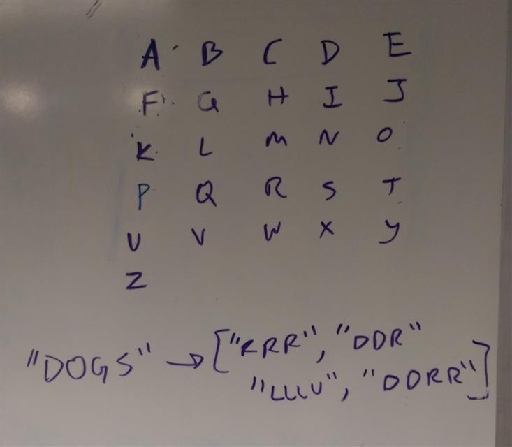

# Puzzles
The Goplayground links are so you can see how they work online without having go installed.
(to run the tests manually, copy the repository, navigate to the puzzle folder and run `go test` and it will print the answer)

## matrix

* You are given a matrix of letters, and the goal of this puzzle is to print the directions you need to take to navigate the matrix to complete the given string. (in the image above you can see the example "dogs" returns ["RRR","DDR","ULLL","DDRR"])
* [GOPLAYGROUND](https://play.golang.org/p/hw3v9T-dFn)

## staircase
* Print a staircase of hashtags given any integer within 100.
* [GOPLAYGROUND](https://play.golang.org/p/K4smWHE_MH)
